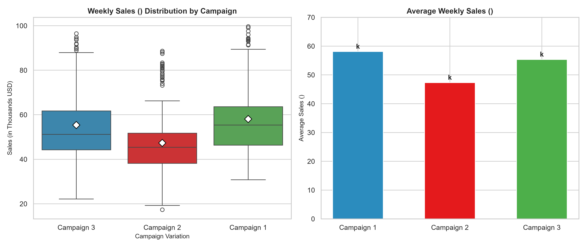
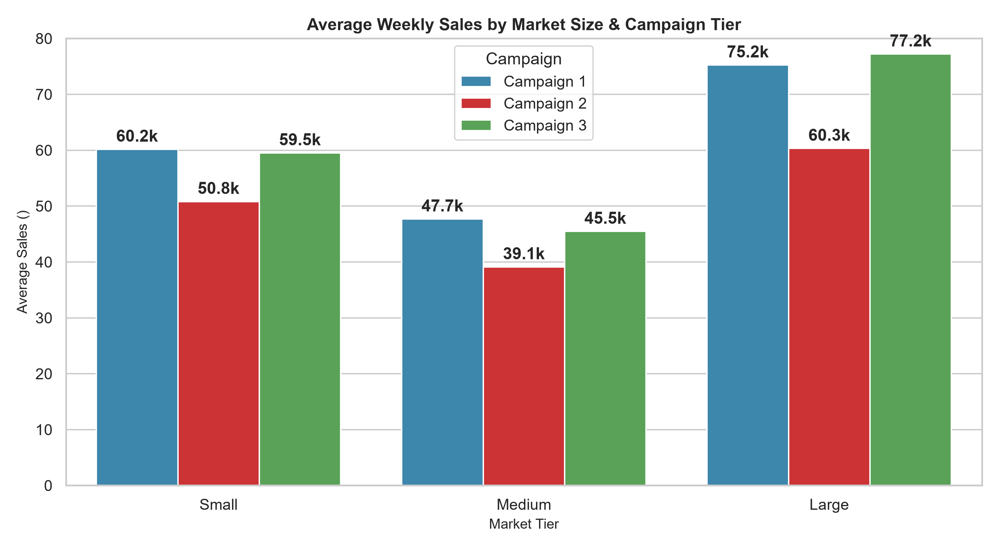
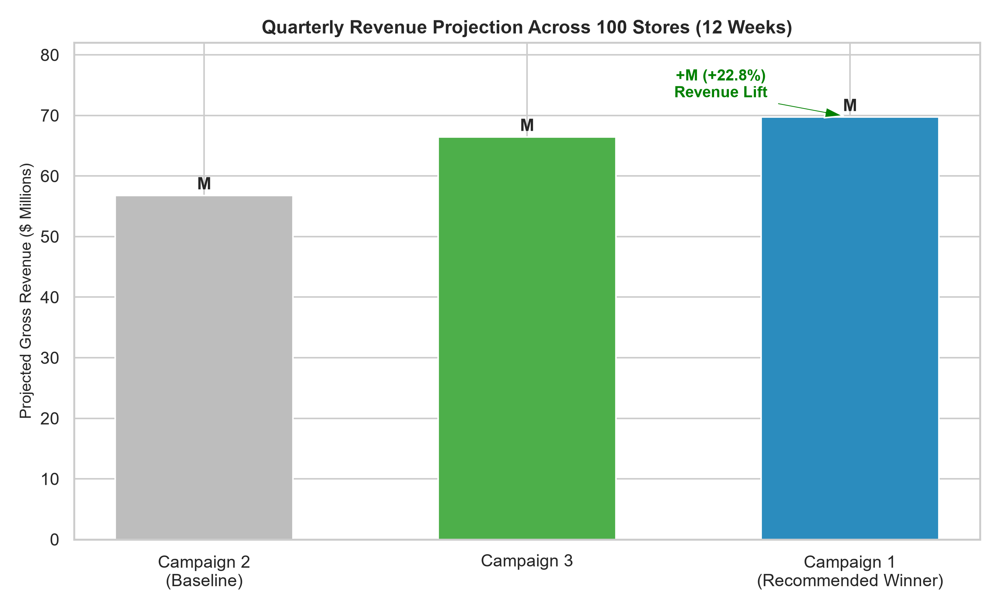

# 📈 Optimizing Fast-Food Marketing Campaign Performance via A/B Testing & Statistical ROI Analysis

[](https://www.python.org/)
[](https://pandas.pydata.org/)
[](https://scipy.org/)
[](https://streamlit.io/)
[](https://colab.research.google.com/github/Makrufkasr/Marketing_Campaign_Using_Statistics/blob/main/Marketing_Campaigns_Using_Statistics_.ipynb)

---

## 📌 1. Executive Summary

Sebuah jaringan restoran cepat saji (*fast-food chain*) berencana meluncurkan menu baru. Untuk memaksimalkan pendapatan dan efisiensi biaya pemasaran, manajemen menguji **3 strategi promosi berbeda (Campaign 1, 2, dan 3)** di 137 lokasi cabang selama 4 minggu (total 548 observasi mingguan).

### 🎯 Key Highlights:
1. **Campaign 1 dan Campaign 3 menghasilkan rata-rata penjualan tertinggi**: Masing-masing sebesar **$58.10k** dan **$55.36k** per minggu per cabang.
2. **Campaign 2 memiliki performa paling rendah**: Rata-rata hanya **$47.33k** per minggu per cabang.
3. **Hasil Uji Signifikansi Statistik (Welch's t-test, $\alpha = 0.05$)**:
   - Campaign 1 menghasilkan **peningkatan penjualan sebesar +22.8%** dibanding Campaign 2 ($p < 0.001$, signifikan secara statistik).
   - Campaign 3 menghasilkan **peningkatan penjualan sebesar +17.0%** dibanding Campaign 2 ($p < 0.001$, signifikan secara statistik).
   - Perbedaan performa antara **Campaign 1 vs Campaign 3 tidak signifikan secara statistik** ($p = 0.121$).

---

## 📊 2. Visualizations & Statistical Evaluation



### Summary of Experiment Results

| Campaign Group | Sample Size ($n$) | Avg Sales / Week ($'000) | Std Deviation | vs Campaign 2 (Sales Lift) | Statistical Significance ($\alpha = 0.05$) |
| :---: | :---: | :---: | :---: | :---: | :---: |
| **Promotion 1** | 172 | **$58.10k** | 16.55 | **+22.8%** | ✅ Significant ($p = 0.000$) |
| **Promotion 2** | 188 | **$47.33k** | 15.11 | Baseline | - |
| **Promotion 3** | 188 | **$55.36k** | 16.77 | **+17.0%** | ✅ Significant ($p = 0.000$) |

> **Perbandingan Head-to-Head (Promotion 1 vs Promotion 3)**: $t = 1.556$, $p = 0.121$ *(Tidak terdapat perbedaan yang signifikan secara statistik pada tingkat kepercayaan 95%)*.

---

## 🏢 3. Market Size Performance Breakdown



- **Large Market**: Menghasilkan respon paling kuat terhadap promosi dengan rata-rata penjualan tertinggi di **Campaign 1 ($72.8k/wk)** dan **Campaign 3 ($77.2k/wk)**.
- **Medium & Small Market**: Konsisten menunjukkan keunggulan Campaign 1 dan 3 dibanding Campaign 2.

---

## 💼 4. Business Impact & Financial ROI Simulation

Untuk mengilustrasikan dampak keputusan ini pada skala bisnis riil, dibuat simulasi penerapan kampanye pada **100 cabang restoran** selama **1 Kuartal (12 minggu)**:



### ⚙️ Asumsi Skenario Bisnis:
- **Skala Rollout**: 100 Cabang
- **Durasi Kampanye**: 12 Minggu (1 Kuartal = 1.200 *store-weeks*)
- **Estimasi Gross Margin Menu**: 60%
- **Biaya Pemasaran (Marketing Cost)**:
  - **Campaign 1 (Omnichannel / Media Nasional)**: $1.200.000 ($1,2M)
  - **Campaign 2 (Baseline)**: $400.000 ($0,4M)
  - **Campaign 3 (In-Store Promo & Local Ads)**: $600.000 ($0,6M)

### 📊 Simulasi Finansial (1 Kuartal):

| Metrik Finansial | Campaign 2 *(Baseline)* | Campaign 3 | Campaign 1 *(Winner)* | Selisih (C1 vs Baseline) |
| :--- | :---: | :---: | :---: | :---: |
| **Rata-rata Penjualan/Minggu/Toko** | $47.33k | $55.36k | **$58.10k** | **+$10.77k (+22.8%)** |
| **Total Gross Revenue** | $56,80 Juta | $66,43 Juta | **$69,72 Juta** | **+$12,92 Juta** |
| **Gross Profit (Margin 60%)** | $34,08 Juta | $39,86 Juta | **$41,83 Juta** | **+$7,75 Juta** |
| **Marketing Campaign Cost** | $0,40 Juta | $0,60 Juta | **$1,20 Juta** | +$0,80 Juta |
| **Net Profit Contribution** | $33,68 Juta | $39,26 Juta | **$40,63 Juta** | **+$6,95 Juta** |
| **Return on Marketing Investment (ROMI)** | - | **9.63x** | **6.46x** | - |

---

## 🧠 5. Strategic Decision Matrix & Recommendations

| Prioritas | Rekomendasi Aksi | Rasional Bisnis |
| :---: | :--- | :--- |
| **1** | **Segera Hentikan Campaign 2** | Menghindari *revenue loss* sekitar **~$10.77k per cabang/minggu** dibanding Campaign 1. |
| **2** | **Skenario Maksimasi Laba (Pilih Campaign 1)** | Memberikan kontribusi laba bersih tertinggi (**+$6,95 Juta net profit lift**) pada peluncuran skala penuh. |
| **3** | **Skenario Efisiensi Anggaran (Pilih Campaign 3)** | Memberikan efisiensi modal pemasaran terbaik (**ROMI 9.63x** dengan biaya 50% lebih murah dari Campaign 1) dengan performa penjualan yang setara secara statistik. |
| **4** | **Fokus pada Cabang Large Market** | Mengalokasikan proporsi budget promosi terbesar ke pasar berukuran besar untuk akselerasi pendapatan. |

---

## 🔬 6. Methodology & Statistical Rigor

1. **Data Preprocessing & Sanity Check**:
   - Memastikan tidak ada *missing values* atau data duplikat.
   - Pengecekan distribusi perlakuan across *Market Size* (Small, Medium, Large) dan *Age of Store* untuk menjamin *random assignment* bebas bias.
2. **Exploratory Data Analysis (EDA)**:
   - Analisis persebaran total pendapatan per variasi promosi.
   - Distribusi penjualan mingguan menggunakan boxplot dan barplot.
3. **Hypothesis Testing (Welch’s Two-Sample t-Test)**:
   - **$H_0$**: Tidak terdapat perbedaan rata-rata penjualan antara promosi yang diuji ($\mu_A = \mu_B$).
   - **$H_1$**: Terdapat perbedaan rata-rata penjualan yang signifikan ($\mu_A \neq \mu_B$).
   - Digunakan *Welch's t-test* (`equal_var=False`) untuk mengantisipasi ketidaksamaan varians antar populasi sampel.

---

## 📁 7. Project Structure

```text
Marketing_Campaign_Using_Statistics/
├── assets/
│   ├── sales_distribution.png
│   ├── market_size_performance.png
│   └── business_impact.png
├── data/
│   └── WA_Marketing-Campaign.csv
├── app.py                                   # Streamlit Interactive Dashboard
├── Marketing_Campaigns_Using_Statistics_.ipynb
├── requirements.txt
├── .gitignore
└── README.md
```

---

## 🚀 8. How to Run Locally

### Jalankan Dashboard Streamlit:
```bash
# 1. Clone repository
git clone https://github.com/Makrufkasr/Marketing_Campaign_Using_Statistics.git
cd Marketing_Campaign_Using_Statistics

# 2. Install dependencies
pip install -r requirements.txt

# 3. Jalankan dashboard
streamlit run app.py
```

### Jalankan Jupyter Notebook:
```bash
jupyter notebook Marketing_Campaigns_Using_Statistics_.ipynb
```

---

## 👤 Author
- **Makruf Kasr**
- [LinkedIn Profile](https://www.linkedin.com/) • [GitHub Repository](https://github.com/Makrufkasr/Marketing_Campaign_Using_Statistics)
